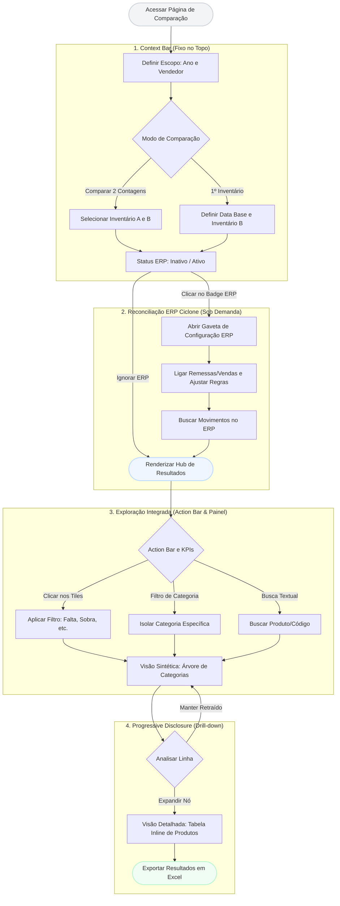

# Plano de Melhoria: Página "Comparar Inventários"

Este documento detalha o planejamento para a refatoração e melhoria de UX/UI da página `CompararInventarios.tsx`, seguindo os mesmos princípios arquiteturais e visuais aplicados ao plano da página "Panorama". O objetivo é transformar uma experiência atualmente fragmentada e baseada em passos (wizard) em um ambiente de análise fluido, integrado e direto.

---

## 1. Diagnóstico Atual

A análise do código atual de `CompararInventarios.tsx` revela os seguintes gargalos de experiência:

*   **Falsa Sensação de Wizard (Abas 1, 2 e 3):** A configuração da comparação está presa em três abas (`Escopo`, `Inventários`, `ERP`). Isso obriga o usuário a clicar por abas para entender o contexto atual, escondendo configurações essenciais (ex: parâmetros de reconciliação ERP) quando a aba 3 não está ativa.
*   **Modos de Leitura Segregados:** A dicotomia entre `Tabela` (detalhada) e `Gestor` (sintética/analítica) força o usuário a alternar contextos de tela inteira para responder perguntas que são naturalmente complementares ("Quanto falta?" vs "Quais produtos faltam?").
*   **Poluição e Dispersão Visual:** Avisos condicionais soltos (alertas), barra de recorte separada dos KPIs, e seletores de data/empresa do ERP tomando muito espaço.
*   **Hierarquia de Filtros Confusa:** O `filtroLinha` se mistura com os *tiles* de KPI (que também agem como botões de filtro), além da busca global e filtro de categorias, espalhados em níveis diferentes.

---

## 2. Nova Arquitetura de Informação: O Hub de Comparação

A solução propõe achatar a navegação. O usuário não deve "configurar para depois ver", mas sim "ver e ajustar o contexto continuamente".

### A. Context Bar Integrada (Fim das Abas)
Substituir o componente `Tabs` por uma **Barra de Contexto (Context Bar)** fixa no topo, composta por *chips* ou seletores compactos (estilo dropdowns combinados):
*   **Escopo:** `[Ano] | [Vendedor]`
*   **Contagens:** `[Inventário A (ou Base)] ➔ [Inventário B]` (com atalho para "Primeiro Inventário").
*   **Integração ERP:** Um *Badge* interativo `[ERP: Reconciliado]` ou `[ERP: Inativo]`. Clicar nele abre um *Popover* ou *Sheet* (gaveta lateral) com todas as opções complexas: toggles de Remessa/Venda, datas de ajuste, escolha de empresa e base de emissão.
*   *Benefício:* O contexto da comparação inteira é visível em uma única linha o tempo todo.

### B. Fusão dos Modos (Gestor + Tabela)
Em vez de alternar entre `PainelGestor` e `Table` com um switch, a tela deve adotar o padrão de **Progressive Disclosure (Drill-down)**:
1.  **Visão Padrão (Gestor):** A tabela inicia agregada por hierarquia (Marca ➔ Tipo ➔ Subtipo ➔ Produto), aproveitando o layout em árvore ou agrupamentos colapsáveis.
2.  **Expansão Inline:** Ao expandir uma categoria, os produtos exatos que compõem aquela divergência aparecem aninhados (ou em um painel lateral/split-screen), mantendo o contexto sintético visível.

### C. Faixa de KPIs como Controle de Fluxo
Os 4 *tiles* atuais (`Acuracidade`, `Falta`, `Sobra`, `Saldo`) têm uma lógica excelente (atuam como filtros). Eles devem ser elevados visualmente para formar uma **Action Bar**:
*   Ficarão fixos abaixo da *Context Bar*.
*   Quando o usuário clica em "Falta", o tile ganha o estado ativo (cores semânticas do `DESIGN_SYSTEM.md`, como bg-warning-subtle e border-warning), e a lista/árvore abaixo filtra imediatamente.
*   A busca e o filtro de categorias ficam alinhados a esta faixa.

---

## 3. Diretrizes de Layout e Design System

Seguindo estritamente as regras do `DESIGN_SYSTEM.md`:

*   **Tipografia e Números:** Uso obrigatório de `tabular-nums` em todas as colunas de quantidade (Qtd A, Remessa, Venda, Esperado, Qtd B, Diferença) e valores em R$, para alinhar as casas decimais perfeitamente.
*   **Cores Semânticas:**
    *   *Faltas (Divergência negativa):* Usar `text-warning-strong`, `bg-warning-subtle` (nunca vermelho destrutivo, pois falta não é um erro de sistema, é um dado de negócio que exige atenção).
    *   *Sobras (Divergência positiva):* Usar `text-info-strong`, `bg-info-subtle`.
    *   *Iguais / Sem Diferença:* Usar tons neutros (muted).
*   **Raio de Bordas:** Inputs e modais do ERP usando bordas arredondadas padrão do sistema (`rounded-lg` para controles, `rounded-xl` para cartões).

---

## 4. Tratamento de Avisos e Erros

A página atual gera muitos alertas em caixas grandes (`Alert` do Lucide).
*   **Proposta:** Criar um **Centro de Diagnóstico** ou *Callout* consolidado abaixo dos KPIs. Se houver mais de um aviso (ex: "Sem produtos em comum", "Vendedor sem cadastro no ERP"), eles são empilhados em um único container de Status, em vez de empurrar o conteúdo da página para baixo com 3 alertas separados.

---

## 5. Plano de Implementação (Roadmap)

1.  **Fase 1: Refatoração do Header (Context Bar)**
    *   Remover `<Tabs>`.
    *   Criar o cabeçalho fixo com seletores horizontais de Escopo e Inventários.
    *   Mover configurações de ERP para um `<Sheet>` (Drawer lateral) ou modal, liberando espaço vertical.
2.  **Fase 2: Unificação de Filtros e KPIs**
    *   Extrair os `tiles` para um componente próprio que sinalize visualmente seu estado de *toggle* (ativo/inativo).
    *   Unir `<SearchFilter>` e `<FiltroCategorias>` à mesma barra dos KPIs.
3.  **Fase 3: Visão Integrada (Árvore de Dados)**
    *   Substituir a troca rígida (estado `modoLeitura`) por uma Tabela Expansível ou manter o `PainelGestor` como raiz, injetando a visualização em nível de linha (produto) no último nó da árvore analítica.
4.  **Fase 4: Polimento e Acessibilidade**
    *   Garantir transições suaves e aderência total aos tokens do Design System.
    *   Revisar responsividade (a tabela de divergência costuma quebrar ou exigir muito scroll horizontal; repensar colunas ocultáveis em telas menores).

# User Flow: Hub de Comparação de Inventários

Este documento mapeia o novo fluxo de usuário (User Flow) para a página **Comparar Inventários**, visualizando a jornada descrita no nosso plano de melhorias. O foco aqui é demonstrar a fluidez da nova **Context Bar** integrada, em contraste com o antigo formato de "abas (wizard)", além de ilustrar como o usuário mergulha nos dados (Progressive Disclosure).

## 1. Diagrama de Fluxo (Mermaid)

---

## 2. Detalhamento das Etapas do Fluxo

### Etapa 1: Context Bar
- **Como é hoje:** O usuário preenchia a Etapa 1 (Escopo), clicava na aba da Etapa 2 (Contagens), escolhia A e B, e depois ia para a aba Etapa 3 (ERP). 
- **Novo Fluxo:** O usuário cai na página e a barra superior já pede o Escopo e as Contagens na mesma linha. Ele vê todo o contexto da tela em um bater de olhos sem precisar navegar entre abas.

### Etapa 2: Reconciliação ERP
- **Como é hoje:** Todos os toggles (Remessa, Venda), campos de data e selects do ERP ocupavam grande parte da tela na Etapa 3, distanciando o usuário dos resultados.
- **Novo Fluxo:** Um simples botão/badge na Context Bar (`ERP: Desativado`). Ao clicar, um *Drawer* (gaveta lateral) ou *Modal* desliza para a tela permitindo a configuração fina sem perder o contexto dos dados. Após aplicar, a gaveta fecha.

### Etapa 3: Exploração (Filtros e KPIs)
- **Como é hoje:** Os *tiles* de acuracidade, falta, sobra e saldo se misturavam na página e mudavam a tabela abruptamente, enquanto as buscas ficavam espalhadas pelo cabeçalho.
- **Novo Fluxo:** Agrupados em uma *Action Bar*, os *tiles* agem como abas rápidas de investigação. Clicar em "Faltas" aplica a cor de `warning` ao tile e filtra a visão sintética imediatamente, integrando-se aos selects de Categoria.

### Etapa 4: Drill-down (Tabela Expandida)
- **Como é hoje:** Se o usuário visse que a categoria "Óculos Solares" tinha uma grande diferença no Gestor, precisava trocar no seletor para o modo "Tabela", buscar a categoria no filtro e só então ver os produtos.
- **Novo Fluxo:** Dentro da visão do Gestor, o usuário clica em expandir na linha de "Óculos Solares" e uma tabela (com as colunas de Produtos, Esperado, Qtd B, Diferenças) se abre no formato *inline*, permitindo inspecionar o produto divergente sem perder o cenário gerencial.

